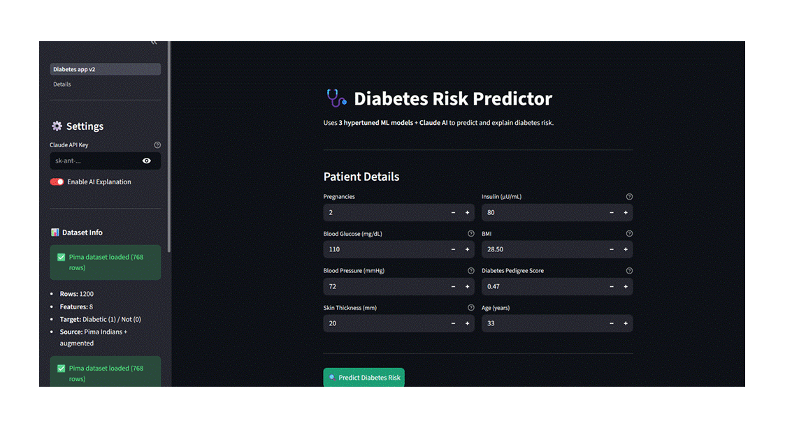
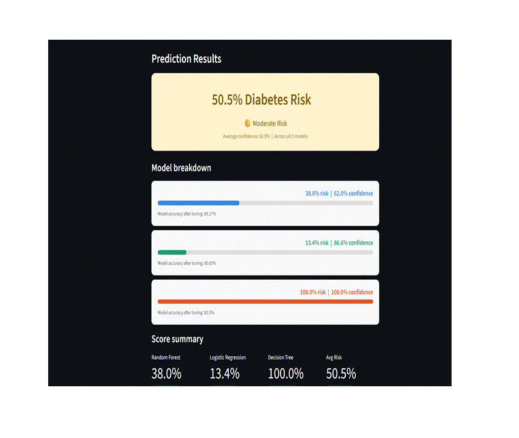

# 🚗 Car Object Detection using ResNet50 + Optimizer Comparison


---

## 📌 Overview

This project implements a **Car Object Detection system** using **Transfer Learning with ResNet50**.
It predicts bounding boxes around cars in images and compares the performance of different optimizers.

Along with detection, the project includes a **Streamlit web app** to:

* Upload images and detect cars
* Compare optimizer performance visually
* View accuracy statistics

---

## 🎥 Demo

### 🔍 Car Detection Demo



> ⚠️ Tip: Record a short screen capture of your Streamlit app and save it as `demo.gif` for best impact.

---

## 🎯 Key Features

* 📦 Transfer Learning using ResNet50 (pretrained on ImageNet)
* 🎯 Bounding Box Prediction (x, y, width, height)
* ⚙️ Comparison of 4 optimizers:

  * Adam
  * SGD
  * RMSprop
  * Adagrad
* 📊 Visualization of Validation Loss & MAE
* 🌐 Interactive Streamlit UI
* 📈 Performance tracking across epochs

---

## 🧠 Model Architecture

* Base Model: **ResNet50 (Frozen Layers)**
* Custom Layers:

  * GlobalAveragePooling
  * Dense (ReLU)
  * Dropout (0.5)
  * Output Layer (4 neurons → bounding box)

---

## 📂 Project Structure

```
car-object-detection/
│
├── data/                     # Dataset (not uploaded)
├── saved_model/              # Trained models
│
├── preprocess.py             # Data preprocessing
├── model.py                  # ResNet50 model definition
├── train.py                  # Training with 4 optimizers
├── evaluate.py               # Model evaluation
├── visualize.py              # Graphs + detection output
├── app.py                    # Streamlit web app
│
├── config.py                 # Hyperparameters
├── requirements.txt
└── README.md
```

---

## ⚙️ Configuration

* Image Size: `224 x 224`
* Batch Size: `32`
* Epochs: `20`
* Learning Rate: `0.001`

---

## 📊 Optimizer Comparison

The project compares how different optimizers affect model performance.


👉 Insight:

* All optimizers converge to similar loss
* Adam converges faster and more smoothly
* SGD and RMSprop show more fluctuations

---

## 🔄 Workflow

### 1. Data Preprocessing

* Reads CSV annotations
* Normalizes bounding boxes
* Resizes images to 224×224
* Splits into train/validation

---

### 2. Model Training

* Trains model with 4 optimizers
* Saves each model separately
* Stores training history for comparison

---

### 3. Evaluation

* Loads saved models
* Prints validation loss & MAE comparison

---

### 4. Visualization

* Plots optimizer performance
* Generates detection output image

---

### 5. Web App (Streamlit)

Features:

* Upload image → Detect car
* Select optimizer model
* Compare performance graphs
* View best optimizer stats

---

## 🚀 How to Run

### Step 1: Install Dependencies

```bash
pip install -r requirements.txt
```

### Step 2: Preprocess Data

```bash
python preprocess.py
```

### Step 3: Train Models

```bash
python train.py
```

### Step 4: Evaluate Models

```bash
python evaluate.py
```

### Step 5: Run Web App

```bash
streamlit run app.py
```

---

## 📈 Results Summary

* All optimizers perform similarly after convergence
* Adam generally gives faster and more stable results
* Best optimizer is selected based on lowest validation loss

---

## 🧪 Dataset

* Source: Kaggle Car Object Detection Dataset
* Contains:

  * Car images
  * Bounding box annotations (xmin, ymin, xmax, ymax)

---

## 🛠 Tech Stack

* Python
* TensorFlow / Keras
* OpenCV
* NumPy / Pandas
* Matplotlib
* Streamlit

---

## ⚠️ Notes

* Dataset and models are excluded from GitHub due to size
* Train the model locally before running the app

---

## 💡 Future Improvements

* Use YOLO / Faster R-CNN for better detection
* Add multi-object detection
* Improve dataset size & augmentation
* Deploy on cloud (AWS / Hugging Face Spaces)

---

## 🧾 Conclusion

This project demonstrates how **transfer learning + optimizer tuning** impacts model performance in object detection.
It also provides a **complete ML pipeline + deployable UI**, making it strong for placements.

---

# 🩺 Diabetes Risk Predictor (ML + Streamlit)


---

## 📌 Overview

This project builds a **Diabetes Risk Prediction system** using multiple machine learning models and serves it via a **Streamlit web app**. The app collects patient inputs and predicts diabetes risk using an ensemble of models.

---

## 🎥 Demo


> Record your app screen and save it as `demo.gif` to showcase this section.

---

## 🎯 Key Features

* 🔍 Predict diabetes risk from patient inputs
* 🌲 Uses 3 ML models:

  * Random Forest
  * Linear Regression
  * Decision Tree
* 📊 Displays individual model predictions + average risk
* ⚡ Fast predictions using pre-trained models
* 🌐 Interactive UI with Streamlit

---

## 🧠 Models Used

* Random Forest Regressor
* Linear Regression
* Decision Tree Regressor

👉 Final prediction = **Average of all 3 models** fileciteturn1file7

---

## 📂 Project Structure

```
diabetes-predictor/
│
├── models/                # Saved models (pickle)
├── preprocess.py          # Data preprocessing
├── train.py               # Train & save models
├── predict.py             # Load models + predict
├── evaluate.py            # Model evaluation (R2 score)
├── app.py                 # Simple Streamlit UI
├── Diabetes_app_v2.py     # Advanced UI (better UX)
└── README.md
```

---

## ⚙️ Workflow

### 1. Data Preprocessing

* Uses sklearn diabetes dataset
* Splits into train/test
* Applies StandardScaler fileciteturn1file6

---

### 2. Model Training

* Trains 3 models
* Saves them using pickle
* Saves scaler for inference fileciteturn1file8

---

### 3. Prediction

* Loads saved models
* Scales input
* Returns predictions from all models fileciteturn1file5

---

### 4. Evaluation

* Uses R² score for performance comparison fileciteturn1file4

---

### 5. Web App

* Takes user input (age, BMI, etc.)
* Shows prediction instantly
* Displays model-wise output fileciteturn1file1

---

## 🚀 How to Run

### Step 1: Install Dependencies

```bash
pip install -r requirements.txt
```

### Step 2: Train Models

```bash
python train.py
```

### Step 3: Run App

```bash
streamlit run app.py
```

---

## 📊 Results

* Multiple models improve reliability
* Ensemble average gives stable prediction
* Random Forest usually performs best

---

## 🛠 Tech Stack

* Python
* Scikit-learn
* NumPy
* Streamlit
* Pickle

---

## ⚠️ Notes

* Models are saved locally in `/models`
* Ensure models are trained before running app
* This is for **educational use only**

---

## 💡 Future Improvements

* Convert to classification (diabetic / non-diabetic)
* Add probability-based risk score
* Deploy on cloud (Streamlit Cloud)
* Add explainability (SHAP)

---

## 🧾 Conclusion

This project demonstrates a **complete ML pipeline** from preprocessing → training → evaluation → deployment. It highlights how multiple models can be combined to improve prediction reliability.

